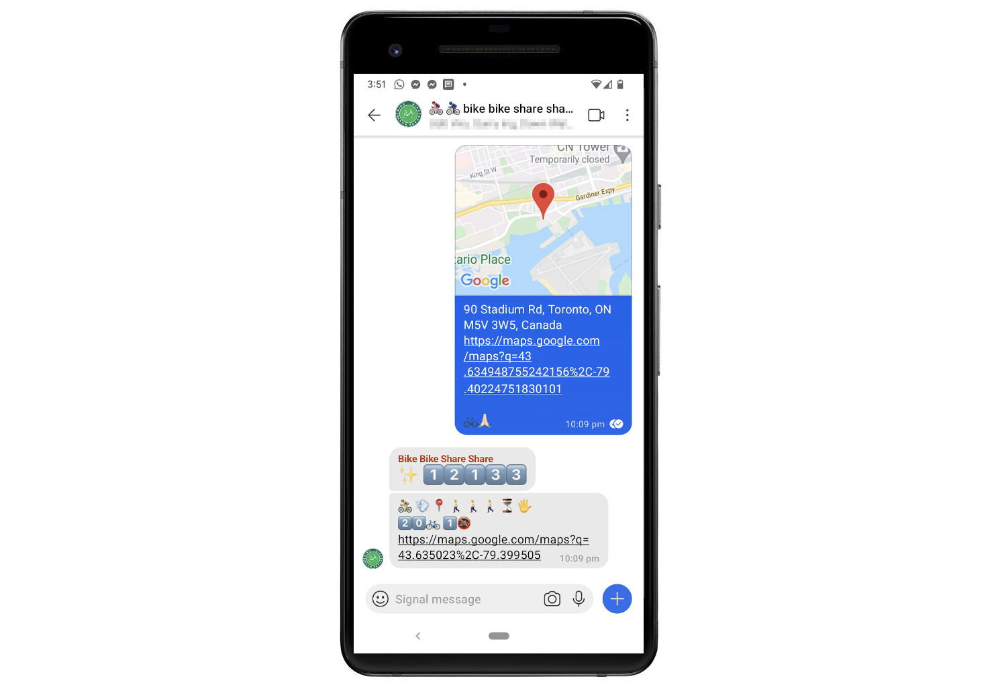

# bike bike share share bot

[![Keep a Changelog v1.1.0 badge][changelog-badge]][changelog]
[![Swagger API badge][swagger-badge]][swagger-ui]

<a href="docs/screenshot.jpg"></a>

A bot for watching a Signal messenger group, and sharing bikeshare ride codes with those who ask.

It runs on a Digital Ocean instance as a daemonized process that watches a designated group for messages.

## Commands

| Command | Description |
|---------|-------------|
| `<location>`<br />:round_pushpin: | _"what's nearby?"_ Requests info from nearest station.
| `<location>`<br />:bike::pray:    | _"bike, please!"_ Requests ride code for nearest station.
| :lock::arrow_left::bike:     | _"bike's returned!"_ Tells group that bike was returned, and echos final ride time.
| :stopwatch:                  | _"what's my ride status?"_ Great for mid-trip, this echos current ride time. (same as above)

## Roadmap

- [x] Runs as a daemonized process on a server
- [x] Watches messages in one Signal group
- [x] Shares a single membership between group members
- [x] Responds to :bike::pray: ("bike please") pin drops: instant ride codes for nearest station
- [ ] Shows dock availability [#9][]
- [x] Searches for nearest bike dock in relation to a pin drop [#2][]
  - [ ] Supports optional hinting for heading east/west/north/south [#14][]
  - [ ] Supports optional filtering for nearest e-bike [#8][]
  - [ ] Responds to direct messages [#4][]
- [ ] Discourages non-emoji communcation [#13][]
- [ ] Notifies group when ride has ended and bike available again [#6][]
- [x] Alerts group when overage fees accumulate [#7][]
- [ ] Allows faster ride code generation in exchange for memes [#10][]
- [x] Runs as a real Signal user or a Signal bot [#3][]

<!-- Links -->
   [#9]: https://github.com/patcon/bikebikeshareshare-bot/issues/9
   [#2]: https://github.com/patcon/bikebikeshareshare-bot/issues/2
   [#14]: https://github.com/patcon/bikebikeshareshare-bot/issues/14
   [#8]: https://github.com/patcon/bikebikeshareshare-bot/issues/8
   [#4]: https://github.com/patcon/bikebikeshareshare-bot/issues/4
   [#6]: https://github.com/patcon/bikebikeshareshare-bot/issues/6
   [#7]: https://github.com/patcon/bikebikeshareshare-bot/issues/7
   [#10]: https://github.com/patcon/bikebikeshareshare-bot/issues/10
   [#13]: https://github.com/patcon/bikebikeshareshare-bot/issues/13
   [#3]: https://github.com/patcon/bikebikeshareshare-bot/issues/3

## Usage

Requirements: `signal-cli` (already configured)

```
# One terminal window
$ make start-daemon PHONE=+15555555555

# New terminal window
$ brew install python@3.9 pygobject3 gtk+3
$ pipenv --python `which python3.9` --site-packages install
$ cp sample.env .env
$ vim .env
$ make prepare-osx
$ pipenv run python check.py --help

Usage: check.py [OPTIONS]

  Check messages in a Signal group for Bikeshare Toronto code requests.

Options:
  -u, --bikeshare-user TEXT       Bikeshare Toronto member account username
                                  (not yet functional)

  -p, --bikeshare-pass TEXT       Bikeshare Toronto member account password
                                  (not yet functional)

  -t, --bikeshare-auth-token TEXT
                                  Bikeshare Toronto member account derived
                                  authorization token  [required]

  -k, --bikeshare-api-key TEXT    Bikeshare Toronto application API key
                                  [required]

  -g, --signal-group TEXT         Signal messengers group ID  [required]
  --noop                          Fake contact to Bikeshare servers
  -d, --debug                     Show debug output
  -h, --help                      Show this message and exit.
```

<!-- Links -->
   [changelog]: ./CHANGELOG.md
   [changelog-badge]: https://img.shields.io/badge/changelog-Keep%20a%20Changelog%20v1.1.0-%23E05735
   [swagger-badge]: https://img.shields.io/badge/swagger-OpenAPI%20v2.0-%2338b832
   [swagger-ui]: https://editor.swagger.io/?url=https://raw.githubusercontent.com/patcon/bikebikeshareshare-bot/main/bikeshare-swagger-spec.yml
